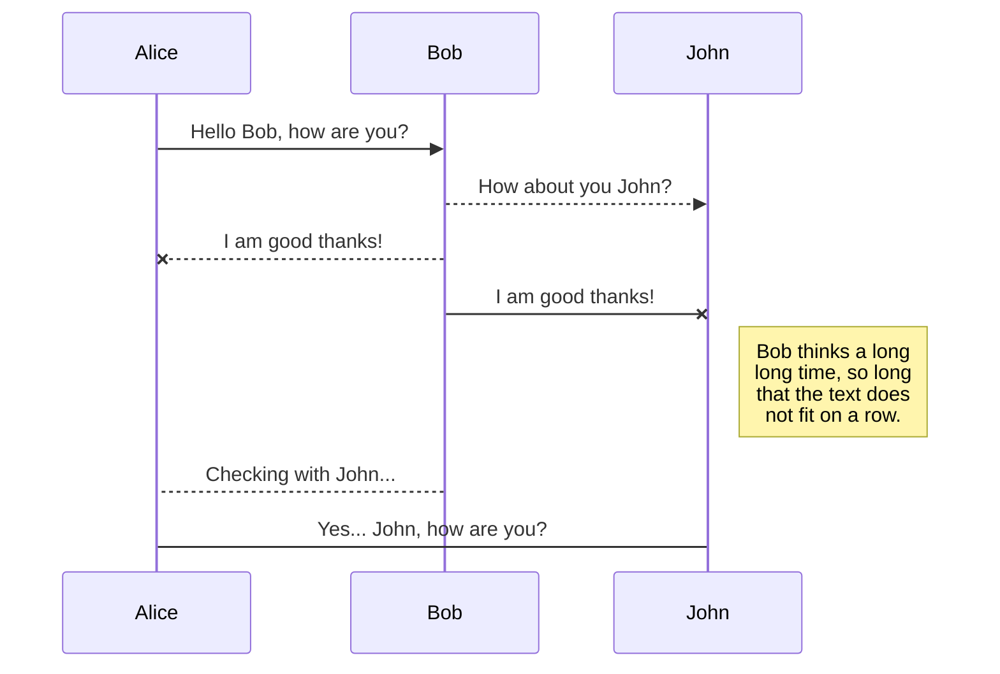
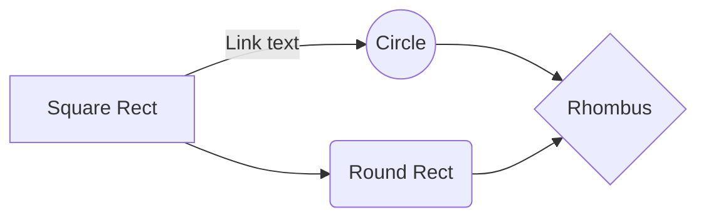

# GDB Debugging Mechanics using PTRACE
Before we start :)

First things first — a fun fact about Linux processes: parents get special backstage passes to their kids, including the power to ptrace them. And guess what? When you run a debugger, it basically becomes the helicopter parent of your program. Linux even lets processes adopt children, so the debugger can swoop in and say, “Yep, that one’s mine now.”

## 1. The System Call (SYSCALL)

A **system call** (**syscall**) is how a running **user program** requests a service from the computer's **core operating system kernel**. It's the only way a regular program can safely access essential services, like reading a file or sending network data. This request makes the computer temporarily switch into a highly protected mode to perform the job.

---

## 2. Introduction to PTRACE

The GDB debugger fundamentally relies on the **`ptrace`** system call.

The manual describes `ptrace` as:
>"The ptrace() system call provides a means by which one process (the "tracer") may observe and control the execution of another process (the "tracee"), and examine and change the tracee's memory and registers."

* **Note on Threads:** When tracing a multi-threaded executable, GDB typically traces individual threads. You can choose to attach to specific threads, and threads not attached via a `ptrace` call will not be debugged at all.

### PTRACE Signature

The standard signature for the `ptrace` system call is:

```c
long ptrace(enum __ptrace_request request, pid_t pid, void *addr, void *data);

```

----------

## 3. Process Attachment (`PTRACE_ATTACH`)

To begin debugging, the tracer (GDB) must attach to the target process (tracee), typically using the `PTRACE_ATTACH` request:

C

```
ptrace(PTRACE_ATTACH, target_pid, 0, 0);

```

### Attachment Flow (Behind the Scenes)

1.  **Kernel Checks:** The Kernel first verifies if the target process exists and if the tracer has the necessary **permissions** to trace it.
    
2.  **Set Trace Flag:** The Kernel sets a **special internal flag**, marking the process as being traced.
    
3.  **Halt Tracee:** The Kernel sends a **`SIGSTOP`** signal to the tracee to halt its execution.
    
4.  **Tracer Waits:** Meanwhile, the tracer calls the **`waitpid()`** system call, blocking its execution until the tracee stops.
    
5.  **Kernel Wakes Tracer:** When the tracee finally stops, the Kernel wakes up the waiting tracer.
    
6.  **Status Reporting:** The Kernel returns the PID of the tracee and populates the `status` variable passed to `waitpid()`. This status typically indicates the stop event by reporting it as a **`SIGTRAP`**.
    

At this point, the tracee is **stopped**, and the tracer (GDB) has control, ready for subsequent debugging operations.

----------

## 4. Reading and Writing Memory (PEEK vs. POKE)

GDB uses `PTRACE_PEEKDATA` to read and `PTRACE_POKEDATA` to write, typically transferring a **single machine word** (e.g., 8 bytes) per call.

### A. Reading Memory (`PTRACE_PEEKDATA`)

Signature:


```C
long value = ptrace(PTRACE_PEEKDATA, target_pid, (void*)target_addr, NULL);

```

How it works:

1.  **GDB Requests:** GDB sends the `PTRACE_PEEKDATA` request, specifying the target PID and the desired virtual address.
    
2.  **Kernel Check:** The Kernel ensures the target process is **stopped**.
    
3.  **Address Translation:** The Kernel uses the tracee's **Page Tables** to convert the virtual address into a physical RAM address.
    
4.  **Data Fetch:** The Kernel reads one machine word directly from that physical RAM location.
    
5.  **Return Value:** The Kernel sends the fetched data back to GDB as the return value of the `ptrace` call.
    

### B. Writing Memory (`PTRACE_POKEDATA`)

Signature:
```c
long data_to_write = 0xCC; // e.g., the INT 3 instruction for a breakpoint
ptrace(PTRACE_POKEDATA, target_pid, (void*)target_addr, (void*)data_to_write);

```

-   **Important Note:**
	 For `PTRACE_POKEDATA`, the Kernel must validate that the tracer has the necessary write permissions. The mechanism for writing is similar to reading: the Kernel translates the virtual address and then directly writes the provided data into the tracee's physical memory map.
    

----------

## 5. Single Stepping Mechanism

Single stepping relies on the `ptrace` syscall and a dedicated hardware feature: the **CPU's Trap Flag (TF)**.

### 1. Setup

-   **GDB Request:** GDB calls `ptrace` with **`PTRACE_SINGLESTEP`**.
    
-   **Kernel Action:** The Kernel prepares the tracee by setting the **Trap Flag (TF)** in its CPU registers.
    
-   **Resume:** GDB tells the tracee to resume execution.
    

### 2. Execution & Halt

-   **Execute One:** The CPU executes **one** machine instruction.
    
-   **Hardware Trap:** Due to the active TF, the CPU immediately triggers a **Trap Exception** after execution.
    
-   **Kernel Stops:** The Kernel handles the trap, clears the TF, stops the tracee, and sends a **`SIGTRAP`** signal to it.
    

### 3. Debugger Control

-   **GDB Regains Control:** GDB unblocks via `waitpid()` upon receiving the `SIGTRAP`.
    
-   **Inspect State:** GDB uses **`PTRACE_GETREGS`** to read the new Instruction Pointer (IP) and update the debug view.


## UML diagrams

You can render UML diagrams using [Mermaid](https://mermaidjs.github.io/). For example, this will produce a sequence diagram:



And this will produce a flow chart:


